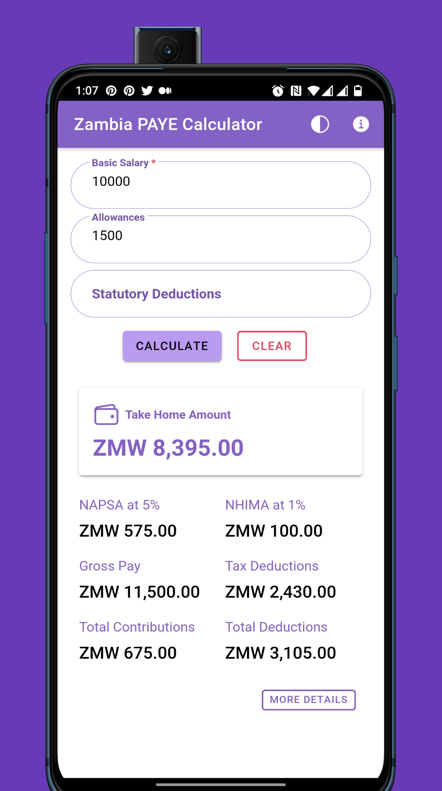
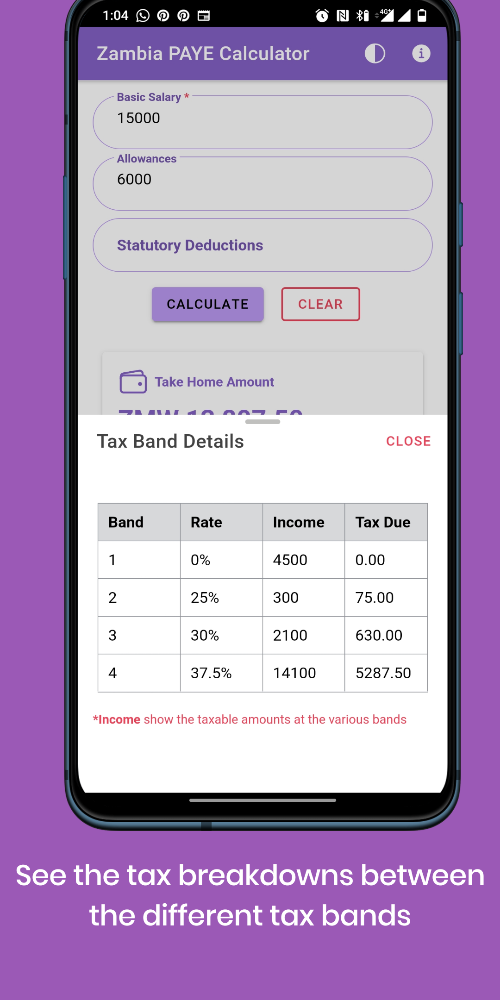

# Pay-As-You-Go (PAYE) Tax Calculator
This is a Zambian PAYE tax calculator build using [Ionic Framework](https://ionicframework.com) and [Angular](https://angular.io).

It shows you the applicable tax deduction and mandatory statutory deductions on a given monthly salary. you can also add any other statutory deductions to the calculation.

### Running It
    npm install
    ionic serve

* You will need to have [Ionic cli](https://ionicframework.com/docs/intro/cli) installed

### Links
Coming soon to the Google Play store.

### Screenshots

### For contributions
Get in touch or open an issue

### License
The MIT License (MIT). Please see [License File](LICENSE) for more information.

Made in :zambia: